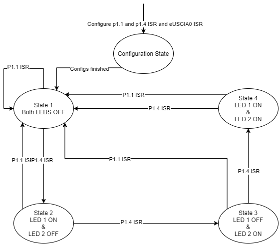
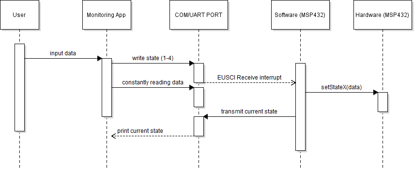

# MSP432-UART
A simple monitoring app built in Python that communicates with the embedded board (MSP432) via serial port (RS232) over the USB connection.

##State Machine Diagram

## Sequence Diagram

